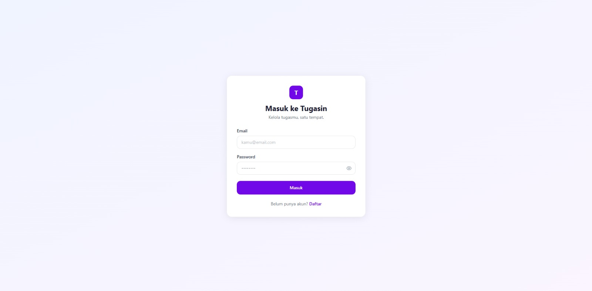
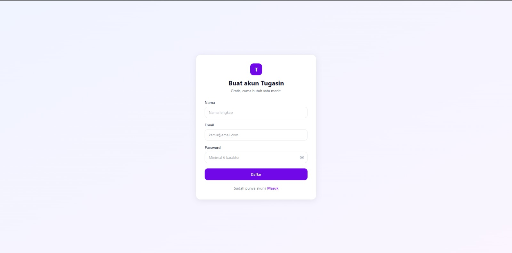
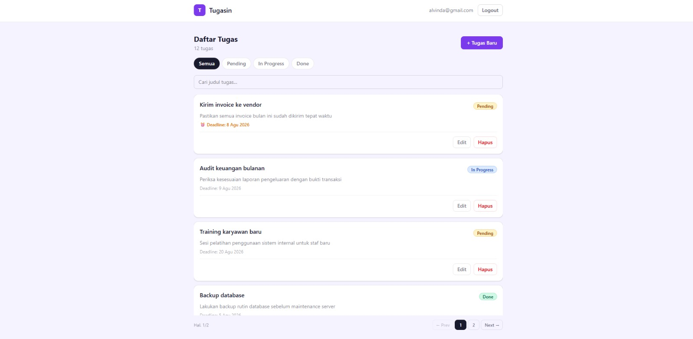
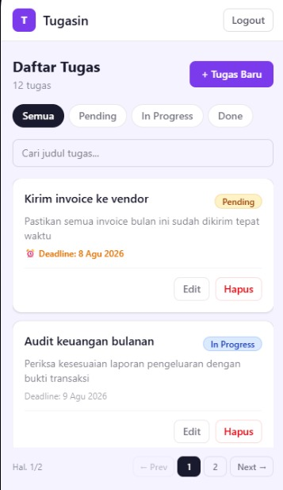

# Task Management System

Aplikasi manajemen tugas berbasis web yang memungkinkan pengguna untuk mendaftar, login, dan mengelola task pribadi mereka. Setiap task memiliki judul, deskripsi, status (pending / in-progress / done), dan deadline. Backend dibangun dengan Node.js + Express, frontend dengan React + TypeScript + Tailwind CSS, dan data disimpan di MySQL.

---

## Screenshots

### Desktop

| Login | Register | Daftar Tugas |
|-------|----------|--------------|
|  |  |  |

### Mobile



---

## Struktur Proyek

```
task-management-system/
├── backend/    # REST API (Node.js, Express, MySQL)
└── frontend/   # UI (React, TypeScript, Vite, Tailwind CSS)
```

---

## Backend

### Prasyarat

- Node.js >= 18
- MySQL >= 8

### 1. Setup Database

Masuk ke MySQL dan jalankan file schema:

```bash
mysql -u root -p < backend/schema.sql
```

Perintah ini akan membuat database `task_management` beserta tabel `users` dan `tasks` secara otomatis.

### 2. Konfigurasi Environment

Salin file contoh lalu isi nilainya:

```bash
cp backend/.env.example backend/.env
```

Edit `backend/.env`:

```env
PORT=5000

DB_HOST=localhost
DB_PORT=3306
DB_USER=root
DB_PASSWORD=your_mysql_password
DB_NAME=task_management

JWT_SECRET=your_very_secret_key
JWT_EXPIRES_IN=7d
```

### 3. Install Dependensi

```bash
cd backend
npm install
```

### 4. Jalankan Server

```bash
# Mode development (auto-restart dengan nodemon)
npm run dev

# Mode production
npm start
```

Server berjalan di `http://localhost:3000` (atau port yang diset di `.env`).

---

## Frontend

### Prasyarat

- Node.js >= 18

### 1. Konfigurasi Environment

Buat file `.env` di folder `frontend`:

```bash
cp frontend/.env frontend/.env.local
```

Pastikan URL backend sudah benar di `frontend/.env`:

```env
VITE_API_URL=http://localhost:3000/api
```

### 2. Install Dependensi

```bash
cd frontend
npm install
```

### 3. Jalankan Dev Server

```bash
npm run dev
```

Aplikasi berjalan di `http://localhost:5173`.

### 4. Build untuk Produksi

```bash
npm run build
```

Output statis akan ada di folder `frontend/dist`.

---

## Tech Stack

| Layer    | Teknologi                              |
|----------|----------------------------------------|
| Frontend | React 19, TypeScript, Vite, Tailwind CSS |
| Backend  | Node.js, Express 5, JWT, bcrypt        |
| Database | MySQL 8                                |
